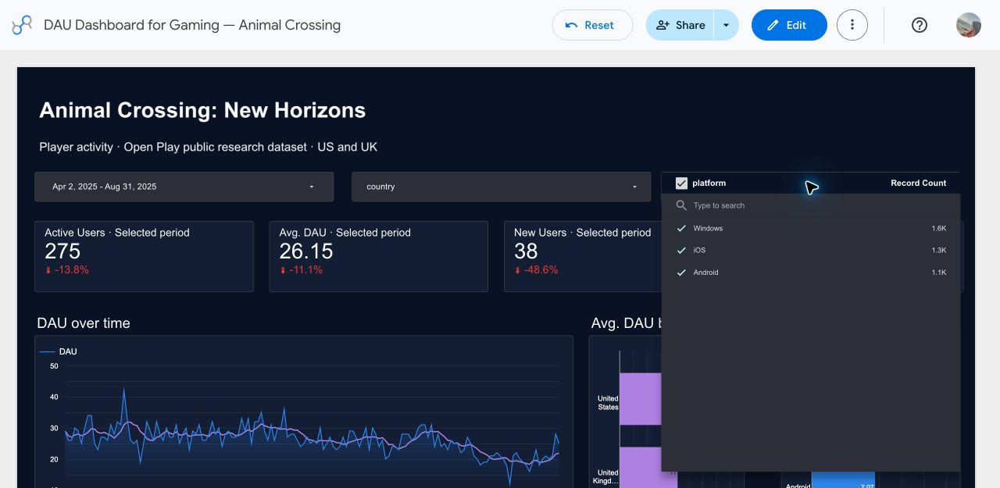
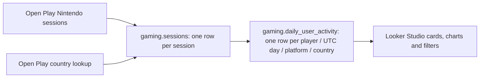

# DAU Dashboard for Gaming

An interactive Google Looker Studio dashboard backed by BigQuery for exploring unique daily active players across multiple years, with date, country and platform filters.

[Open the Looker Studio dashboard](https://datastudio.google.com/u/0/reporting/e091acfa-729e-4263-b500-93d7552ac4fb/page/p_hsrjcjo07d) (Google access may be required).



## Data and demo platforms

The gameplay records come from the public [Open Play research dataset](https://digital-wellbeing.github.io/open-play/), by Nick Ballou and collaborators. This project selects Animal Crossing: New Horizons: **54,994 recorded sessions, 700 pseudonymous participants, and 26,870 daily activity records**. The source covers the US and UK from May 2022 to October 2025.

The original gameplay platform is Nintendo. To demonstrate cross-platform filtering, the reporting view assigns each player a stable illustrative platform: **Windows, Android or iOS**, using `MOD(user_id, 3)`. These categories are demo assignments, not recorded platform telemetry. The original session table retains Nintendo. This is a historical research sample, not a live feed or the game's global player population.

## Data model



One physical fact table (`gaming.sessions`) and one reporting view (`gaming.daily_user_activity`) are used. Country is joined during preparation; no separate dimension table is stored in this simplified model. Sessions spanning midnight contribute activity to every UTC day they touch, excluding the exact end timestamp. Repeated sessions are deduplicated per player and day. UK is mapped to GB for Looker Studio country recognition.

## Metrics

| Metric | Definition |
|---|---|
| Daily DAU graph | Distinct `user_id` for each `activity_date` |
| Active Users card | Distinct players across the entire selected period |
| Average DAU card | Distinct player-day pairs divided by represented activity dates |
| New Users card | Distinct players whose first observed activity occurs in the selection |
| Returning Users card | Distinct players active after their first observed activity date |
| Percentage changes | Comparison with the previous period |

Average DAU displays two decimal places. New refers to first observed activity in this source, not account creation. A player can be both new and returning within a multi-day selection. An entirely empty date is excluded from the average denominator; add a calendar scaffold if zero-activity dates must be included.

## SQL files and setup

1. Use a BigQuery project of your choice. The demonstrated project display name is `dau dashboard for gaming`, with project ID `dau-dashboard-design`. Replace that project ID in the SQL if using another project.
2. Create the dataset in the US region:

   ```sql
   CREATE SCHEMA IF NOT EXISTS `dau-dashboard-design.gaming`
   OPTIONS(location='US');
   ```

3. Run `import-records-1.sql` through `import-records-4.sql` **in order, once**. These files import the actual source records. Batch 1 creates/replaces the session table; later batches append by replacing the table with the existing records plus the next batch. Restart from batch 1 when rebuilding, rather than rerunning an individual append batch.
4. Run the `CREATE OR REPLACE VIEW` statement in `part-2-demo-platforms.sql`. The daily DAU query at its end is optional verification. `part-2-executed.sql` provides the original source-platform version to restore Nintendo.
5. Connect Looker Studio's BigQuery connector to `gaming.daily_user_activity`. Set `activity_date` as the date range dimension. Add country and platform drop-down controls and a date range control. Cards must use automatic date ranges to respond to the controls.
6. Use `dashboard-metrics.sql` to inspect daily DAU and platform-level metrics. Edit its sample date range to match the dashboard. For the Average DAU card, use:

   ```text
   COUNT_DISTINCT(CONCAT(CAST(user_id AS TEXT), "-", CAST(activity_date AS TEXT)))
   / COUNT_DISTINCT(activity_date)
   ```

`bigquery-schema.json` documents the raw session fields. `summary.json` records the source subset counts. The import SQL contains public pseudonymous player IDs; it does not identify participants. Do not attempt reidentification.

## Validation

Date and country selections were compared with BigQuery results:

| Selection | Active players | Average DAU | New | Returning |
|---|---:|---:|---:|---:|
| April 2025, all countries | 123 | 28.37 | 14 | 116 |
| April 2025, US | 76 | 18.20 | 10 | 70 |
| April 24–30, 2025, US | 41 | 19.00 | 3 | 38 |

After assigning demo platforms, April 2–August 31, 2025 produced Windows: 101 active players / 10.32 average DAU; Android: 82 / 7.07; iOS: 92 / 8.76. Overall: 275 active players / 26.15 average DAU. Platform selection was verified in the dashboard.

## Source attribution and license

- [Open Play website](https://digital-wellbeing.github.io/open-play/)
- [Public source repository](https://github.com/digital-wellbeing/open-play)
- [Stable archive](https://doi.org/10.5281/zenodo.17536656)
- [Source license](https://github.com/digital-wellbeing/open-play/blob/main/LICENSE): CC0 with a no-reidentification clause.

Source files: `data/clean/nintendo.csv.gz` and the `pid` / `country` columns from `data/clean/survey_intake.csv.gz`, downloaded on October 5, 2026. Duration was converted from minutes to seconds and public pseudonymous IDs from `p`-prefixed strings to integers. Source country and timestamp values were retained.
