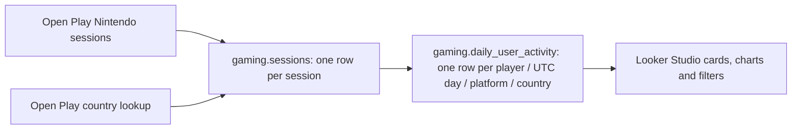

# DAU Dashboard for Gaming

An interactive Google Looker Studio dashboard backed by BigQuery for exploring unique daily active players across multiple years, with date, country and platform filters.

[Open the Looker Studio dashboard](https://datastudio.google.com/u/0/reporting/e091acfa-729e-4263-b500-93d7552ac4fb/page/p_hsrjcjo07d) (Google access may be required).

## Data and demo platforms

The gameplay records come from the public [Open Play research dataset](https://digital-wellbeing.github.io/open-play/), by Nick Ballou and collaborators. This project selects Animal Crossing: New Horizons: **54,994 recorded sessions, 700 pseudonymous participants, and 26,870 daily activity records**. The source covers the US and UK from May 2022 to October 2025.

The original gameplay platform is Nintendo. To demonstrate cross-platform filtering, the reporting view assigns each player a stable illustrative platform: **Windows, Android or iOS**, using `MOD(user_id, 3)`. These categories are demo assignments, not recorded platform telemetry. The original session table retains Nintendo. This is a historical research sample, not a live feed or the game's global player population.

## Data model

One physical fact table (`gaming.sessions`) and one reporting view (`gaming.daily_user_activity`) are used. Country is joined during preparation; no separate dimension table is stored in this simplified model. Sessions spanning midnight contribute activity to every UTC day they touch, excluding the exact end timestamp. Repeated sessions are deduplicated per player and day. UK is mapped to GB for Looker Studio country recognition.

## Metrics

| Metric | Definition |
|---|---|
| Daily DAU graph | Distinct `user_id` for each `activity_date` |
| Active Users card | Distinct players across the entire selected period |
| Average DAU card | Distinct player-day pairs divided by represented activity dates |
| New Users card | Distinct players whose first observed activity occurs in the selection |
| Returning Users card | Distinct players active after their first observed activity date |
| Percentage changes | Comparison with the previous period |

Average DAU displays two decimal places. New refers to first observed activity in this source, not account creation. A player can be both new and returning within a multi-day selection. An entirely empty date is excluded from the average denominator; add a calendar scaffold if zero-activity dates must be included.

